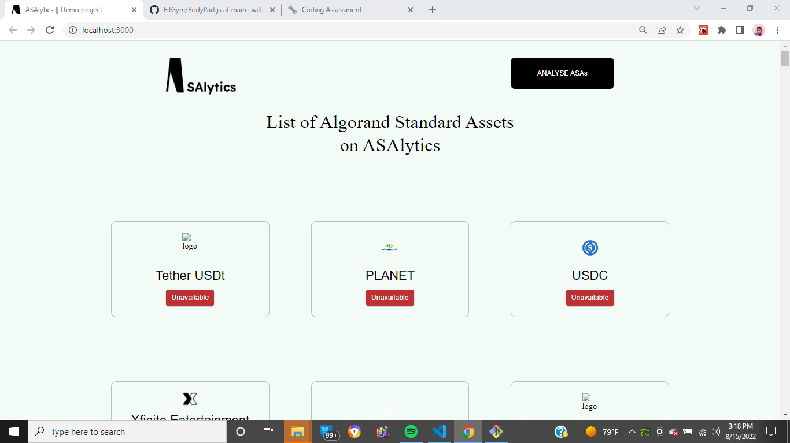

  

<h3 align="center">asalyticsdemo</h3>

 Few lines describing ASAlytics.
      

## 📝 Table of Contents

- [About](#about)
- [Deployment](#deployment)
- [Built Using](#built_using)

## 🧐 About 

ASAlytics is a demo interview project built with react JS and Graphql.

## ⛏️ Built Using 

- [ReactJS](https://reactjs.org/) - Client Framework
- [GraphQL](https://graphql.org/) - API
- [GraphQL Apollo](https://www.apollographql.com/) - Client Query
- [TypeScript](https://www.typescriptlang.org/) - Script

## ✍️ Authors 

- [@willzfrank](https://github.com/willzfrank) - Initial work
